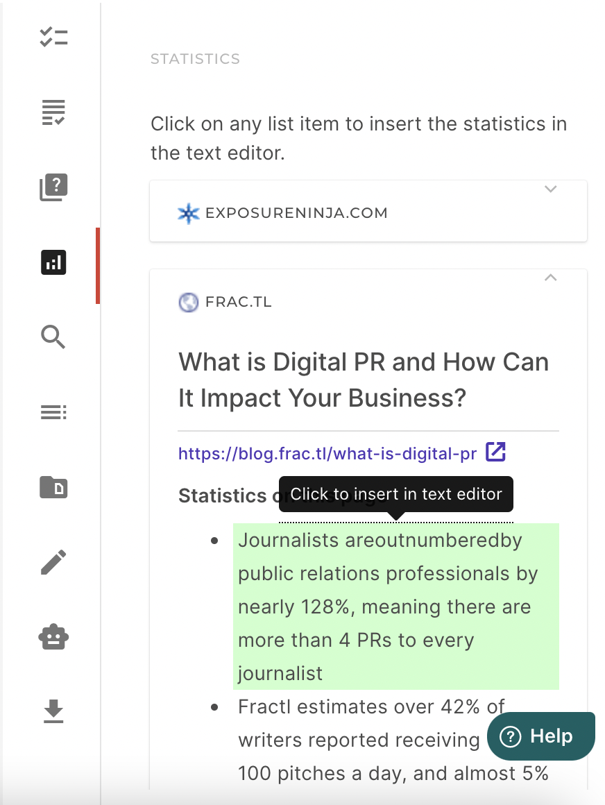

# Content Editor

### What is the Content Score?

The content score is a metric that helps you to know how your article compares to competitors when using our Google Docs Add-On for content optimization.&#x20;

The content score gives you a general score, from F to A, of your document. The score is based on reading scores, the presence of relevant terms and entities, and semantic similarity with the overall SERP results.

### Relevant Topics

### Notes

### Statistics

### Outlines

.png>)

### Smart Copy Tools

**Tip**: Use the _bullet to paragraph_ tool to generate 7 possible paragraph variations using the article title and the paragraph title as inputs. With 7 variations, you have enough text to draft an entire paragraph!

### Export

