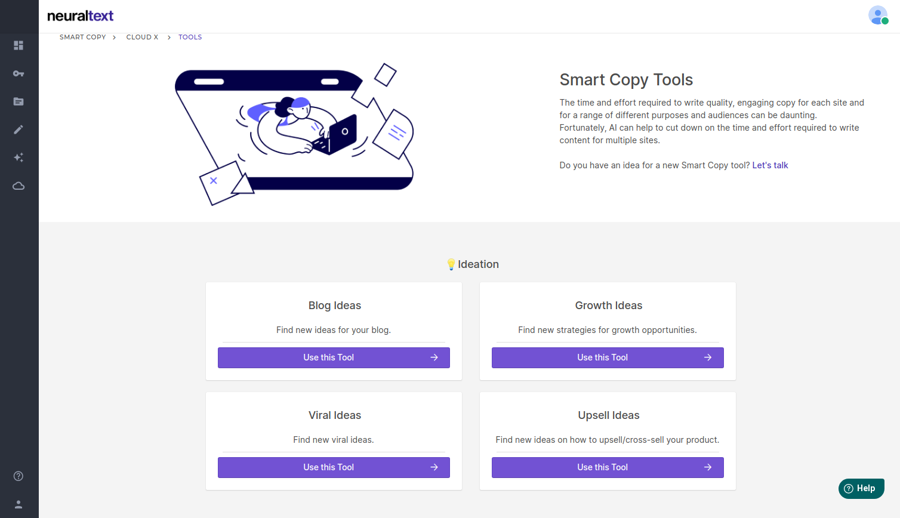

# Smart Copy Tools

## Available Smart Copy Tools

We add new tools every week. To stay updated with our releases, please check our [public roadmap](https://roadmap.neuraltext.com). In our roadmap, you can also suggest new tools to add.

We count 30+ smart copy tools among these categories:

### Ideation

### Website Tools

### Email Tools

### Writing Tools

### Social Media Tools

### Landing Page Tools

### Copywriting Formulas

### Ad Copy and Product Description

## Create a Smart Copy Campaign

1. Visit [**All Campaigns Page**](https://app.neuraltext.com/smartcopy/campaigns/)
2. Click on **Create a new campaign**
3. Type the **Campaign Title**
4. Select the language. This will be the language of all the generated text of that campaign.
5. Click on **Create campaign**
6. You're done!

## Getting started

Let's say we want to create the copy for a product called Cloud X ☁️🔒, a personal cloud device where you can store your personal data and access it from everywhere.

### Step 1: Create a campaign

Go to [Create a New Campaign page](https://app.neuraltext.com/smartcopy/create-campaign/) and choose a name for your campaign and the language.

### Step 2: Select a Tool

Choose one of the available tools. For this tutorial we want to create a _Facebook Ads Primary Text ._

### Step 3: Describe your product

Insert the name of the product "Cloud X" and describe it in 2-3 sentences. You have to use at least 100 characters to generate results.

We will use this description: "The Privacy-First Smart Personal Cloud. Store your data locally and access it from anywhere with this smart personal cloud device."

**Tip:** If you want to use NeuralText like a pro and generate stunning copy, try to rephrase your description with as many details as possible. The results will blow your mind 🤯

### Step 4: Save, delete, export and bulk actions

After you click on "Generate Ideas", the AI will start to generate some results.

#### Copy

Click on the copy icon to copy to clipboard a single ad text.

#### Save

To save a copy, just click on the star icon: you will find the saved texts for this campaign in the "Favorite" tab.

#### Delete

To delete a single ad text, click on the trash bin icon.

#### Bulk Actions

You can also copy, export, and delete texts in bulk.

When no ads are selected, you can select all visible ads clicking on "Select All".

You can also select card singularly by clicking on one or more cards to show four new buttons.

**Copy Selected**

Copy to clipboard multiple ad texts. Paste it in any text editor.

**Export Selected:**

Export the selected cards as a txt file.

**Delete Selected:**

Delete all the selected cards.
