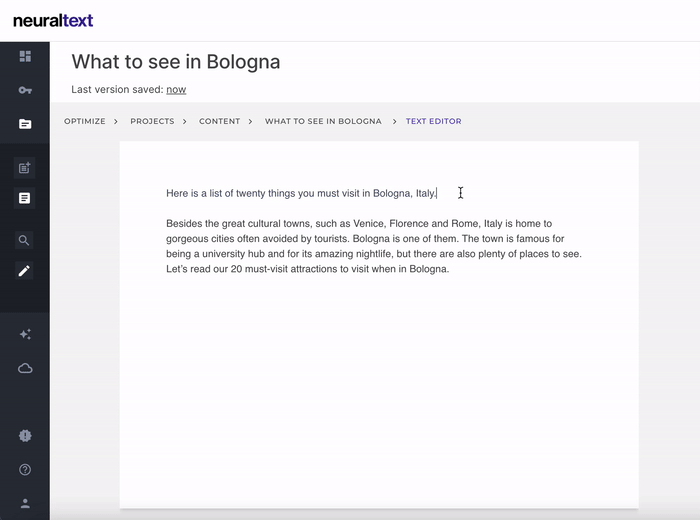

# Long-Form

Using the long-form editor, you will able to rephrase or complete the text in the selection.

## Tools

### Rephrase

This tool allows you write a sentence in different ways, using different words but keeping the same meaning.

### Complete

AI will continue the sentence for you. Write a few words, then select the sentence you want to expand and you're done: we will show a list of alternatives.&#x20;

### FAQ

### Why I have to write **text manually before generating text?**

To avoid the creation of content in an automated way, we have introduced this limit.


**Tip:** To unlock the inline complete text function, you can paste in the editor some new content.


### I don't need SEO insights. Can I use the long-form separately?

To use the long-form editor without SEO data:

1. Go to [Smart Copy Tools](https://app.neuraltext.com/smartcopy/campaigns/)
2. Select a campaign or create a new one
3. Select "**Long-Form Editor" **under the **"✍️ Writing Tools" **section.
4. You are ready to write!

### How much it costs?

Every inline action will cost you 0.5 credits.

